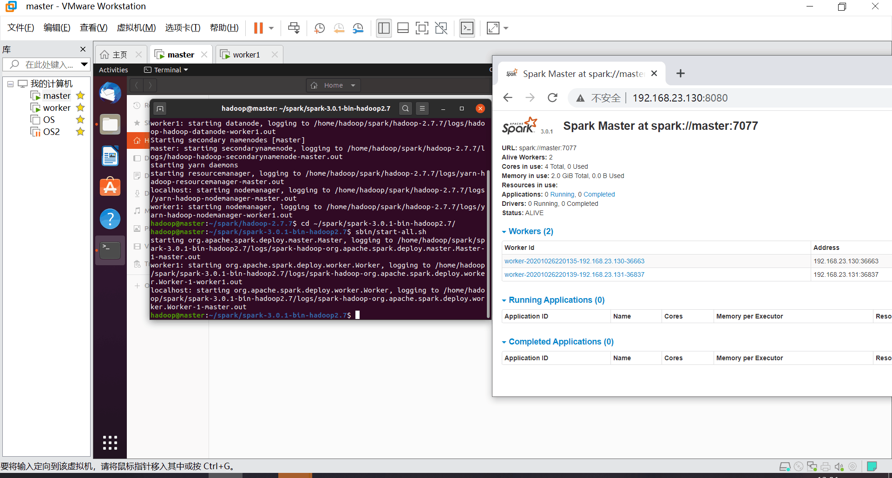
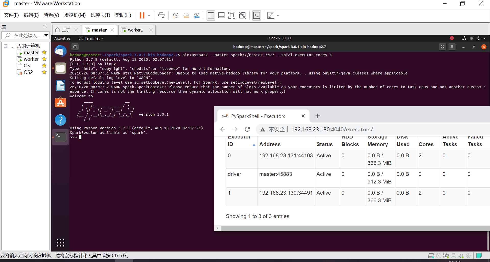
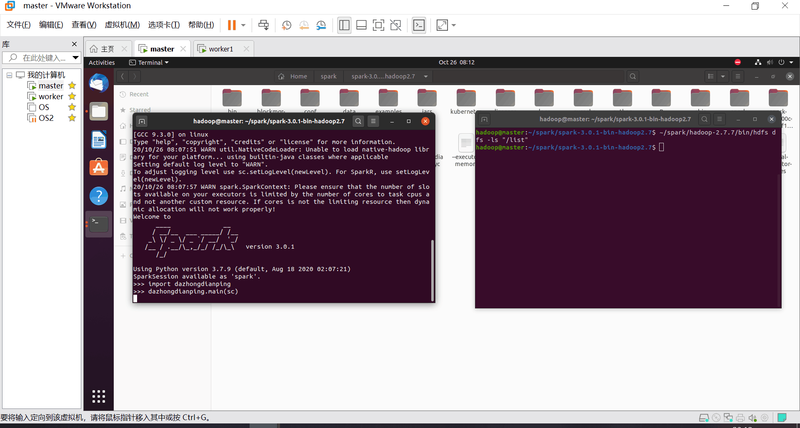
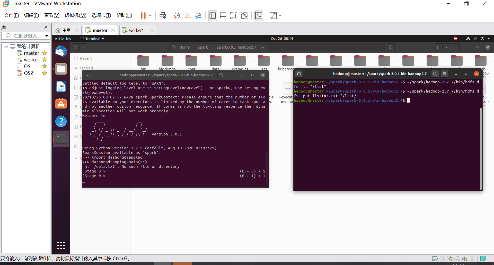
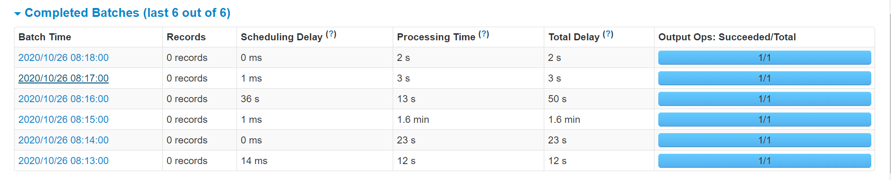

启动spark集群

启动pyspark

bin/pyspark --master spark://master:7077 --total-executor-cores 4

其中master：7077为集群地址，total-executor-cores指定了参与的核数

启动流监听

方法写在dazhongdianping.py中，调用main方法启动spark-streaming

向被监听的文件夹写入文件

写入listtxt.txt

开始运行

1.6min那个是相应到流的，其他比较慢是虚拟机卡

